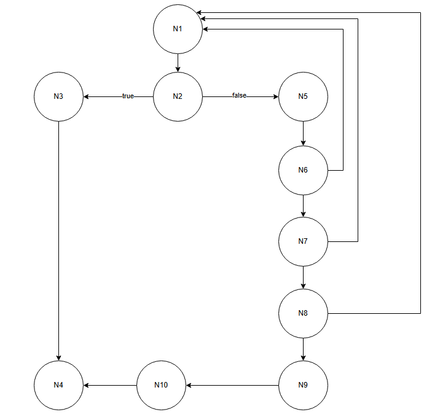

# Algoritmo de Karatsuba

Este projeto implementa o **algoritmo de Karatsuba**, uma técnica recursiva para multiplicação eficiente de inteiros grandes.  
O algoritmo reduz o número de multiplicações necessárias de **4 para 3**, tornando-o mais rápido que a multiplicação tradicional para números com muitos dígitos.

## Lógica da implementação 

```python
def karatsuba(u: int, v: int, n: int) -> int:
    if n <= 3:                       # Caso base: números pequenos são multiplicados diretamente
        return u * v

    mid = n // 2                     # Ponto de corte: divide os números ao meio
    highU, lowU = divmod(u, 10**mid) # Divide u em parte alta (highU) e baixa (lowU)
    highV, lowV = divmod(v, 10**mid) # Divide v em parte alta (highV) e baixa (lowV)

    # Recursão
    highProduct = karatsuba(highU, highV, mid)             # Produto das partes altas
    lowProduct = karatsuba(lowU, lowV, mid)                # Produto das partes baixas
    crossProduct = karatsuba(highU + lowU, highV + lowV, mid + 1)  # Produto das somas

    # Combinação dos resultados segundo a fórmula de Karatsuba
    return (highProduct * 10**(2*mid)
            + (crossProduct - highProduct - lowProduct) * 10**mid
            + lowProduct)
```

## Como executar o projeto
1. Clone o repositório
```bash
    git clone https://github.com/Frederico-dos-Santos/karatsuba.git
```

2. Execute o código
```bash
    python3 karatsuba.py
```

3. Saída esperada
O programa imprime o resultado da multiplicação 123456789101112 * 1314151617181920 usando **Karatsuba**

### Análise de Complexidade Ciclomática
## Fluxo de controle da função
```css
[Início]
   ↓
[n <= 3 ?]
   ├─ True → [Retorna Multiplicação Convencional]
   └─ False → [Divide números]
                ↓
[Chamadas recursivas karatsuba]
                ↓
        [Executa Fórmula]
                ↓
          [Retorna uv total]
```

## Grafo de Fluxo



## Complexidade ciclomática
A **complexidade ciclomática** mede o número de caminhos independentes dentro de uma função, ou seja, quantos fluxos diferentes de execução podem ocorrer.  

Fórmula utilizada:
* M = E - N +2P

* M = 8 - 8 + 2
* M = 2

Ou seja, existem **2 caminhos independentes** na função:  
1. **Caso base**: `n <= 3` → multiplicação convencional.  
2. **Caso recursivo**: `n > 3` → divisão dos números, chamadas recursivas e combinação dos resultados.  

## Complexidade assintótica
A **complexidade assintótica** descreve o comportamento do algoritmo à medida que o tamanho da entrada cresce (número de dígitos `n` nos inteiros).

### Complexidade Temporal: 
A cada etapa do Karatsuba, foram feitas **3 multiplicações recursivas** de metade do tamanho (`n/2`) e operações adicionais de soma/subtração Θ(n).  

- `T(n)=3⋅T(2n​)+O(n)`
- a=3 (número de chamadas recursivas) 
- b=2 (tamanho reduzido pela metade a cada chamada)  
- Complexidade Temporal = Θ(n^log2(3))

### Complexidade Espacial
- O(logn) -> a cada chamada, o tamanho diminui metade

### Análise de casos

- **Melhor caso**: `n <= 3` → retorna diretamente → **Θ(1)** 
 
- **Caso médio**: números grandes → segue a recorrência → **Θ(n^log2(3))**  

- **Pior caso**: igual ao caso médio → **Θ(n^log2(3))**
